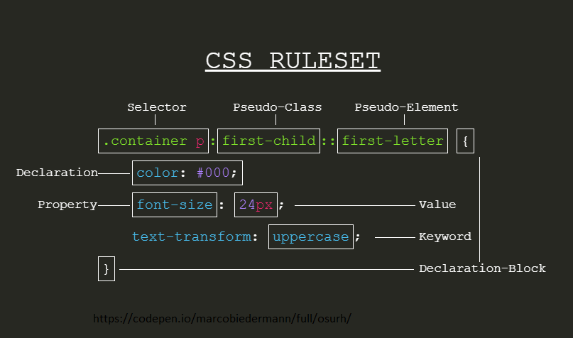

# Terminology

[Source](https://codepen.io/marcobiedermann/full/osurh/)

**[Next chapter 👉](../02-cascade)**

## Learn more

- [CSS Terms and Definitions](https://www.impressivewebs.com/css-terms-definitions/) - Louis Lazaris
- [CSS Vocabulary](http://nimbupani.com/css-vocabulary.html) - Divya Manian
- [What Makes For a Semantic Class Name?](https://css-tricks.com/semantic-class-names/) - Chris Coyier
