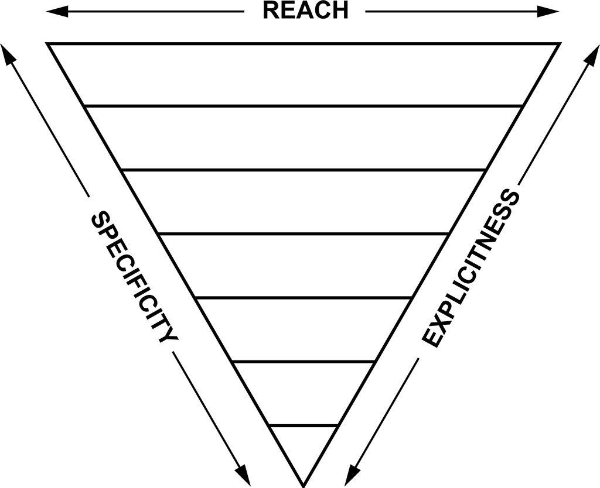
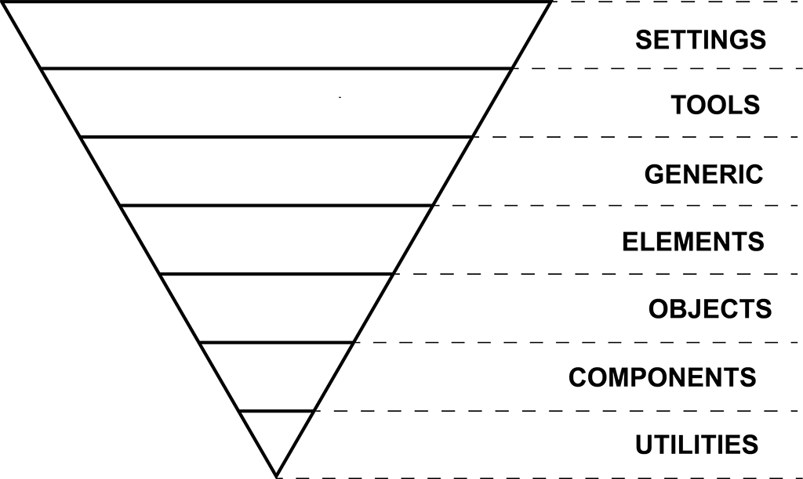

# Specificity

## What is Specificity?

> "**Specificity** is the means by which browsers decide which CSS property values are the most relevant to an element and, therefore, will be applied."
>
> https://developer.mozilla.org/en-US/docs/Web/CSS/Specificity

## How to calculate Specificity

Count the of appearances of each type of selector and give them a weight according to this table.

| selector                                            | weight               |
| --------------------------------------------------- | -------------------- |
| `*`, `>`, `+`, `~`, `:not()`, `@media`, `@supports` | 0 \| 0 \| 0          |
| `span`, `:before`, `:after`, `:first-letter`        | 0 \| 0 \| 1          |
| `.class`, `[attr]`, `:hover`, `:checked`            | 0 \| 1 \| 0          |
| `#id`                                               | 1 \| 0 \| 0          |
| `style=""`                                          | beats every selector |
| `!important`                                        | always wins          |

Specificity Calculator https://specificity.keegan.st/

So, the hierarchy goes like this:

```
elements  <  .classes  <  #IDs  <  inline styles  <  !important
```

Importance of separating numbers:
- 💩 0010 > 00013
- ✅ 0|0|1|0 > 0|0|0|13

### Examples

|                            |             |
| -------------------------- | ----------- |
| `* + *`                    | 0 \| 0 \| 0 |
| `html`                     | 0 \| 0 \| 1 |
| `nav ul li`                | 0 \| 0 \| 3 |
| `nav ul li a`              | 0 \| 0 \| 4 |
| `.nav .link`               | 0 \| 2 \| 0 |
| `.nav .link a`             | 0 \| 2 \| 1 |
| `#nav a`                   | 1 \| 0 \| 1 |
| `#nav li:not(.selected) a` | 1 \| 1 \| 2 |
| `#body #nav`               | 2 \| 0 \| 0 |
| `#body #nav .item a`       | 2 \| 1 \| 1 |
| `style=""`                 | 💩          |
| `!important`               | ⛽ + 🔥      |

### `!important`

Specificity is all about selectors, but when `!important` is present in a rule, that rule will always apply.

```css
li > a {
  color: red;
}

a {
  color: green !important; /* The link will green */
}
```

If two rules have `!important` applied, the rule inside the selector with highest specificity wins.

```css
.nav li a {
  color: green !important; /* The link will green */
}

.nav a {
  color: red !important;
}
```

Never use `!important`, unless you can't increase specificity in any other way or you're [declaring utility classes](https://csswizardry.com/2016/05/the-importance-of-important/). Try first:

- Change source order.
- Increase specificity of the selector in a peaceful way (see _Tricks_ above).

#### Override `!important`

- Add a rule with `!important` inside a selector with higher specificity.

```css
.nav li a {
  color: green !important; /* The link will be green */
}

.nav a {
  color: red !important;
}
```

- Add the same rule with inside the same selector after the original rule you want to override.

```css
li a {
  color: green !important;
}

li a {
  color: red !important; /* The link will be red */
}
```

### `:not` pseudo-class

The `:not` pseudo-class has no weight when calculating specificity, but the selectors included inside do.

```css
.nav li a {
  color: green;
}

/* Won't apply 😢 Watch out the source order! */
.nav li.selected a {
  color: green;
}

.nav li:not(:last-child) a {
  color: red;
}
```

In the future we'll have the [`:where()`](https://www.w3.org/TR/selectors-4/#zero-matches) pseudo-selector which doesn't sum up specificity.

### Facts

- In case of tie, last to arrive wins.
- A class selector beats any number of element selectors.
- The proximity of elements in the DOM has no impact.

  ```css
  body a {
    color: red;
  }

  html a {
    color: green; /* Link will be green */
  }
  ```

- Directly target elements win over inherit styles.

  ```css
  .nav {
    color: red;
  }

  a {
    color: green; /* Link will be green */
  }
  ```

### Quiz

Which color the link will be given the following HTML?

```html
<html>
  <body id="body">
    <nav id="nav" class="nav">
      <ul>
        <li><a class="link">One</a></li>
        <li><a class="link">Two</a></li>
        <li><a class="link">Three</a></li>
        <li><a class="link">Four</a></li>
      </ul>
    </nav>
  </body>
</html>
```

#### 1)

```css
.link {
  color: red;
}

div > div > div > div > div > div > div > div > a {
  color: green;
}
```

#### 2)

```css
body > .nav li {
  color: red;
}

li > a {
  color: green;
}
```

#### 3)

```css
body > [class='nav'] li {
  color: red;
}

li > [class='link'] {
  color: green;
}
```

#### 4)

```css
* > .nav li {
  color: red;
}

li > a {
  color: green;
}
```

#### 5)

```css
* .nav li {
  color: red;
}

li > a {
  color: green;
}
```

#### 6)

```css
ul li a {
  color: green;
}

:root {
  color: red;
}
```

#### 7)

```css
.nav {
  color: green !important;
}

#body #nav a {
  color: red;
}
```

#### 8)

```css
.nav {
  color: green !important;
}

#body #nav a {
  color: red;
}

@media only screen(min-width: 768px) {
  #body #nav a {
    color: blue;
  }
}
```

#### 9)

```css
@media only screen(min-width: 768px) {
  #body #nav a {
    color: blue;
  }
}

.nav {
  color: green;
}

#body #nav a {
  color: red;
}
```

#### 10)

```css
.nav {
  color: green;
}

body .nav a {
  color: red;
}

@supports (display: grid) {
  .nav a {
    color: blue;
  }
}
```

### Tricks

Select elements without increasing specificity.

<!-- prettier-ignore -->
```css
/* #search */
[id='search'] { ... }

/* ul li */
html body li { ... }

/* .header .logo {} */
.logo.logo.logo { ... }
```

## Specificity Graph

Not very useful for CSS-in-JS solutions.

### 💩 Bad


### ✅ Good


### Tools

- https://isellsoap.github.io/specificity-visualizer/
- https://jonassebastianohlsson.com/specificity-graph/

### ITCSS

[ITCSS](https://www.creativebloq.com/web-design/manage-large-css-projects-itcss-101517528) solves specificity problems. Created by [Harry Roberts](https://csswizardry.com).





1. Settings: variables, colors, breakpoints, etc.
2. Tools: global functions, global mixins, etc.
3. Generic: reset, normalize, vertical rythm, etc.
4. Elements: target HTML elements.
5. Objects: reusable design patterns without cosmetics. Example: [`.o-media`](https://codepen.io/danifornells/pen/qrdGrB?editors=1100).
6. Components: reusable, with cosmetics, etc. Example: `.c-product`.
7. Utilities: only one property, normally with `!important`.

## [BEM](https://en.bem.info/methodology/naming-convention/) Naming Convention

- Solves some problems to fight specificity.
- Requires developers to maintain a style.
- [Some problems arise](https://www.smashingmagazine.com/2016/06/battling-bem-extended-edition-common-problems-and-how-to-avoid-them/).

## CSS-in-JS

### Emotion (Styled Components)

Emotion generates CSS class names, we must care about source order and specificity as if we were writing regular CSS.

## Conclusion

Always write the less specific selector that you need. Now you know why it's so bad to nest selectors.

```css
.nav ul .item a {
  width: 30%;
}

@media (min-width: 768px) {
  .nav a {
    width: 20%; /* Won't work 😢 */
  }
}
```

## Learn more

- [Specificity](https://developer.mozilla.org/en-US/docs/Web/CSS/Specificity) - MDN
- [CSS Specificity: Things You Should Know](https://www.smashingmagazine.com/2007/07/css-specificity-things-you-should-know/) - Smashing Magazine, Vitaly Friedman
- [Specificity Calculator](https://specificity.keegan.st/) - Keegan Street
- [Specificity Graph](https://jonassebastianohlsson.com/specificity-graph/) - Jonas Ohlsson
- [Specificity Visualizer](https://isellsoap.github.io/specificity-visualizer/) - Francesco Schwarz
- [Specificity Wars](https://stuffandnonsense.co.uk/archives/css_specificity_wars.html) - Stuff & Nonsense, Andy Clarke
- [CSS Specificity (The Shining)](http://cssspecificity.com) - CSS Dev Conference
- [The Importance of !important: Forcing Immutability in CSS](https://csswizardry.com/2016/05/the-importance-of-important/) - Harry Roberts

**[Next chapter 👉](../04-inheritance)**
